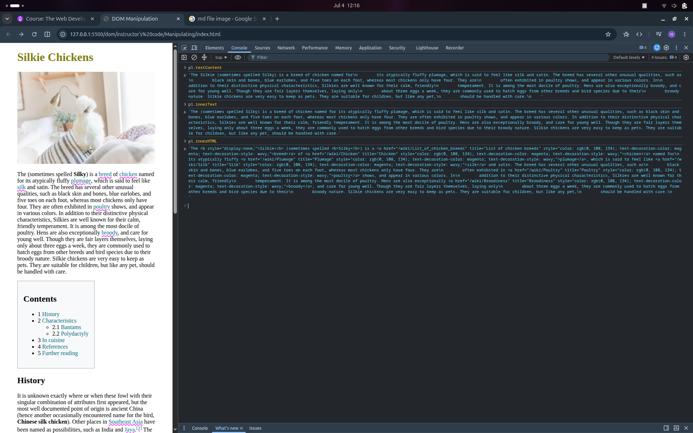

# DOM

DOM long form Document Object Model.

DOM is javascript representation of a web page with js objects.

## Document

It is a special object such as window. It has many usefull methods.
Document will be automatically created by the browser using contnet's of html and css.

document - shows html
console.dir(document) - shows js obejct

## Select element by id

```js
document.getElementById("idName");
```

## Select elements by tagname

This returns html collection. It is iterable but it is not n array.

```js
document.getElementsByTagName("tagName");
```

## Select elements by classname

This returns html collection. It is iterable but it is not n array.

```js
document.getElementsByClassName("className");
```

## Query Selector

It can do all of the above sleect things.

```js

// Find first h1 tag

document.querySelector("h1")

// Find first tag which has class .text

document.querySelector(".text")

// Find tag which has id #header

document.querySelector("#header")

```

If you want to get all matches use 

```js
document.querySelectorAll()
```
We can use any css selectors

```js
// select second h1 tag

document.querySelector("h1:nth-of-type(2)")
```

## Manipulate

### Text and child tags

**innerText** - Text between opening and closing tags

**innerHTML** - Shows texts and tags.

**textContent** - Text between opening and closing tags. It gives everything even display none tags text. It gives line breaks.



### Attributes

Directly access: id, src, href, title

We can access any attribute using a method **getAttribute("attributeName")**.

We can change an attribute or add new attribute using a method **setAttribute("attributeName", value)**.

### Styles

We can use **style** object to change styles.
Everything is string.
style object shows only inline styles. **window.getComputedStyle(element)** shows all.

```js
const h1 = document.querySelector("h1");
h1.style.color = "red"
```

### Classes

**tag.classList** - Is an object which gives you all classes of the tag.

**tag.classList.add()** - Adds new class.

**tag.classList.remove()** - Removes the class.

**tag.classList.contains** - Checks tag has this class.

**tag.classList.toggle()** - If it has it it removes if it does not have it it adds.